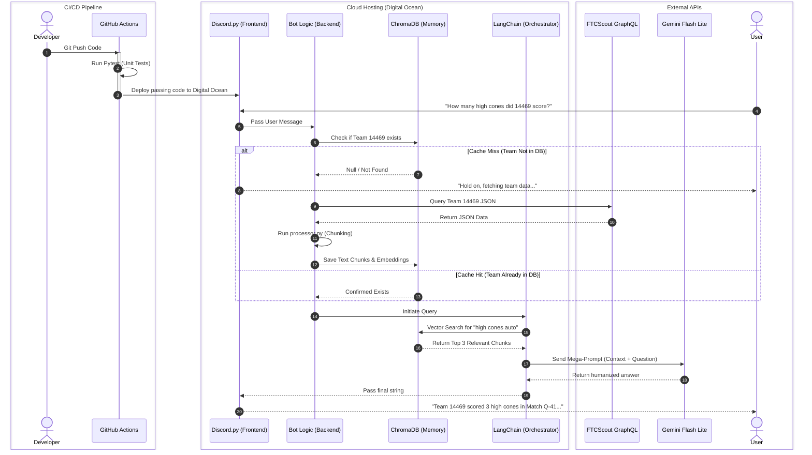

```mermaid
sequenceDiagram
    autonumber
    
    box CI/CD Pipeline
    actor Developer
    participant Actions as GitHub Actions
    end

    box Cloud Hosting (Digital Ocean)
    participant Frontend as Discord.py (Frontend)
    participant Backend as Bot Logic (Backend)
    participant ChromaDB as ChromaDB (Memory)
    participant LangChain as LangChain (Orchestrator)
    end

    box External APIs
    participant FTCScout as FTCScout GraphQL
    participant Gemini as Gemini Flash Lite
    actor User
    end

    %% CI/CD Flow
    Developer->>Actions: Git Push Code
    activate Actions
    Actions->>Actions: Run Pytest (Unit Tests)
    Actions->>Frontend: Deploy passing code to Digital Ocean
    deactivate Actions
    
    %% User Interaction Flow
    User->>Frontend: "How many high cones did 14469 score?"
    Frontend->>Backend: Pass User Message
    
    %% Lazy Loading Database Check
    Backend->>ChromaDB: Check if Team 14469 exists
    
    alt Cache Miss (Team Not in DB)
        ChromaDB-->>Backend: Null / Not Found
        Frontend-->>User: "Hold on, fetching team data..."
        Backend->>FTCScout: Query Team 14469 JSON
        FTCScout-->>Backend: Return JSON Data
        Backend->>Backend: Run processor.py (Chunking)
        Backend->>ChromaDB: Save Text Chunks & Embeddings
    else Cache Hit (Team Already in DB)
        ChromaDB-->>Backend: Confirmed Exists
    end
    
    %% RAG Orchestration
    Backend->>LangChain: Initiate Query
    LangChain->>ChromaDB: Vector Search for "high cones auto"
    ChromaDB-->>LangChain: Return Top 3 Relevant Chunks
    
    %% LLM Generation
    LangChain->>Gemini: Send Mega-Prompt (Context + Question)
    Gemini-->>LangChain: Return humanized answer
    
    LangChain-->>Frontend: Pass final string
    Frontend-->>User: "Team 14469 scored 3 high cones in Match Q-41..."
```