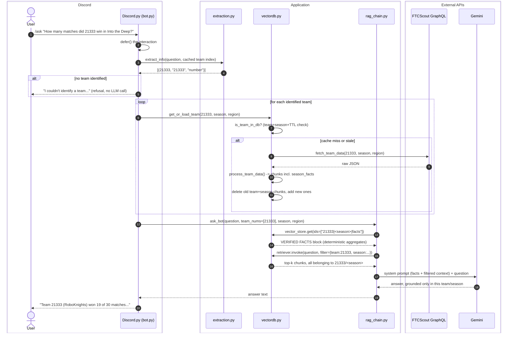

See [docs/architecture.md](docs/architecture.md) for the full request lifecycle and module responsibilities, and [docs/retrieval.md](docs/retrieval.md) for why retrieval is filtered and why aggregate answers come from a precomputed facts block rather than the LLM.
