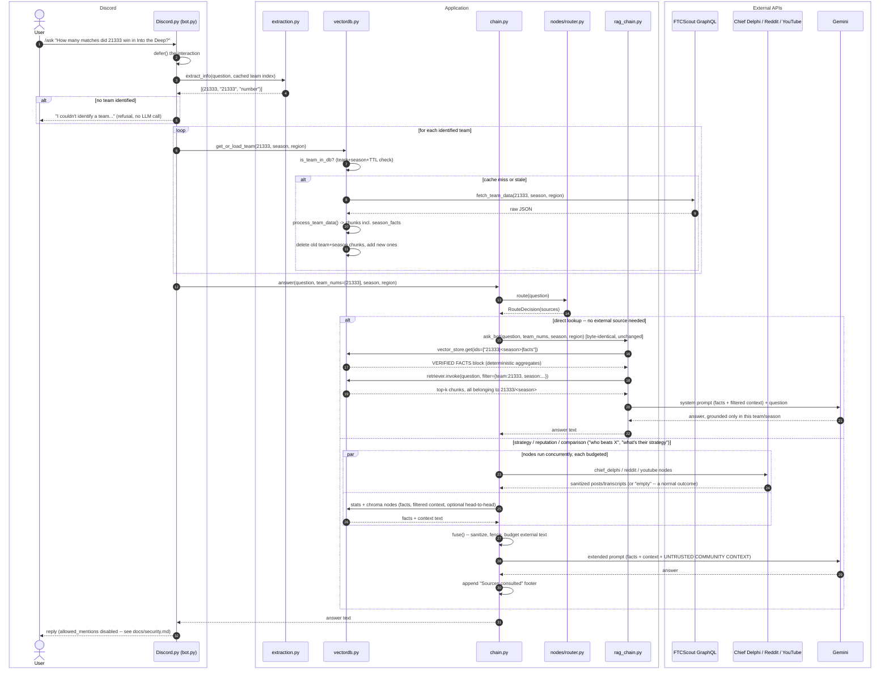

See [docs/architecture.md](docs/architecture.md) for the full request lifecycle and module responsibilities, [docs/retrieval.md](docs/retrieval.md) for why retrieval is filtered and why aggregate answers come from a precomputed facts block rather than the LLM, and [docs/nodes.md](docs/nodes.md) + [docs/adr/0003-multi-source-retrieval-pipeline.md](docs/adr/0003-multi-source-retrieval-pipeline.md) for the routing/community-source branch.
